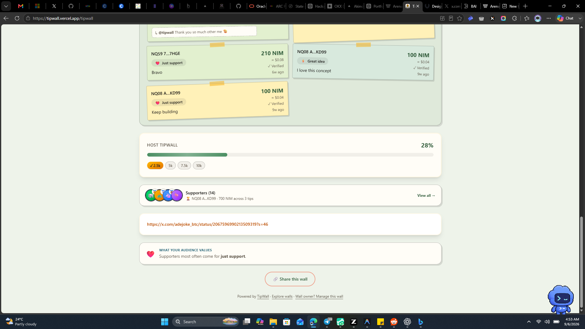

# TipWall Creator Wall Audit

## Screenshot

## Scope

Lower half of the populated creator wall: appreciation feed, goal progress, supporters, featured work link, audience insight, sharing, and footer navigation.

## Overall direction

Keep the current wall structure, but move the creator's featured work closer to the hero and make the goal card more compact. The appreciation feed is the strongest product element and should remain near the top.

## Recommended order

`Hero -> Featured work -> Stats -> Appreciation wall -> Supporters -> Goal and milestones -> Audience insight -> Share`

## Findings

### 1. Appreciation wall

**Health: strong.** This is the emotional center of the product. Keeping it immediately after the stats makes the support visible before secondary creator analytics.

### 2. Featured work

**Priority: high.** Move the content preview directly below the hero. The visible raw `x.com/.../status?...` URL reads like a fallback or technical artifact. Use a compact "Featured work" card with a title, domain, thumbnail or avatar, and an external-link icon. If metadata is unavailable, show a shortened domain/path rather than the full URL.

### 3. Goal and milestones

**Priority: medium.** Keep the goal near the wall, but reduce its visual weight. Show a concrete value such as `700 / 2,500 NIM - 28%`, reduce vertical padding, and make milestone chips quieter. For campaign-led creators, a slim progress meter under the hero can carry the immediate goal while the detailed milestones stay lower.

### 4. Supporters

**Health: good.** The collapsed row is the right public-wall pattern. Replace the fallback `NQ08 A...KD99` with a chosen supporter name or "Top supporter"; reveal the wallet address only in a details view or tooltip.

### 5. Audience insight

**Priority: medium.** Keep it below supporters or move it to the dashboard. It is useful creator insight, but not the main supporter action. Add sample context such as `Just support - 22 of 64 verified tips` so a small sample does not sound definitive.

### 6. Share

**Health: correct placement.** Keep the primary share action at the bottom after visitors have seen the wall. The smaller Share link in the hero is enough for visitors with immediate intent.

## Accessibility checks

- Increase contrast for the small gray supporter metadata and wallet address text.
- The progress bar has semantic progressbar attributes in the implementation.
- Keyboard focus, mobile wrapping, and zoom behavior still need a live responsive check.

## Evidence limits

This audit uses the supplied desktop screenshot and the current source order. A fresh live-browser capture and Figma placement were blocked because the Figma connector is not installed and browser auto-review rejected access to the live site/Figma.

## Source references

- `src/app/[handle]/TipWallClient.tsx`
- `src/components/ContentPreviewCard.tsx`
- `src/components/SupportersWall.tsx`
- `src/components/TipFeed.tsx`
